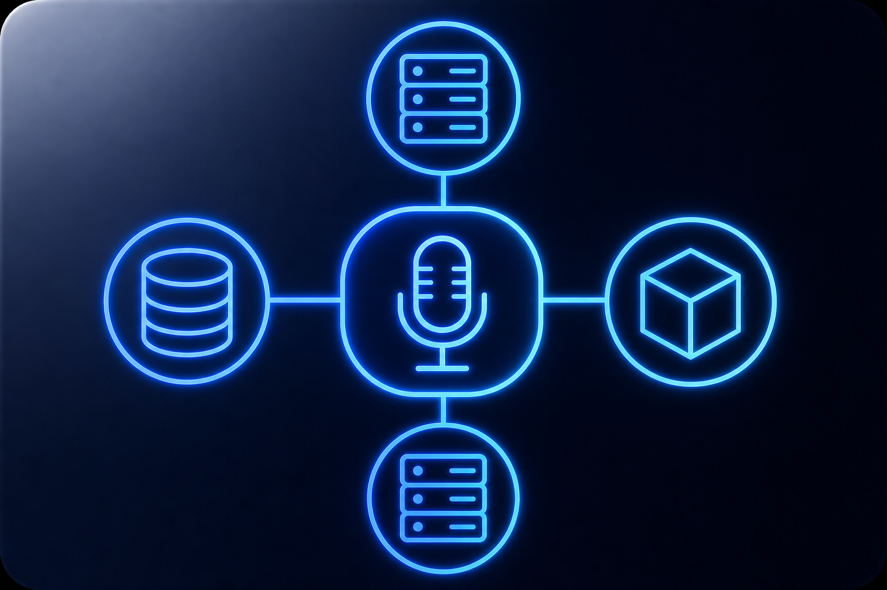

<p align="center">
  
</p>

<h1 align="center">Talk System Design</h1>

<p align="center">
  Simule entrevistas de System Design por voz com IA rodando <strong>100% local</strong> via <a href="https://lmstudio.ai">LM Studio</a>.
</p>

<p align="center">
  
  
  
  
</p>

---

## O que é

**Talk System Design** é um entrevistador de System Design que funciona **100% offline** na sua máquina. Ele usa um modelo de linguagem com visão (via LM Studio), reconhecimento de voz local (Whisper) e síntese de voz em PT-BR (Edge TTS) para conduzir entrevistas técnicas interativas por voz.

Disponível como **app desktop para macOS** (interface gráfica) ou via **terminal (CLI)**.

---

## Como funciona

1. O entrevistador (IA local) faz uma pergunta — o texto aparece na tela e é **falado em PT-BR** via Edge TTS.
2. Você clica em **Gravar Resposta** e fala no microfone.
3. O Whisper local transcreve sua fala automaticamente.
4. Um **screenshot da sua tela** é capturado e enviado junto com o texto para o modelo analisar diagramas ou código visíveis.
5. O ciclo se repete até você encerrar a entrevista ou falar "sair".

---

## Pré-requisitos

| Requisito | Versão / Observação |
|-----------|-------------------|
| macOS | Qualquer — usa `screencapture` e `afplay` nativos |
| Python | 3.9+ |
| LM Studio | Com Local Server na porta 1234 |
| Modelo carregado | Com suporte a visão — recomendado: `qwen/qwen3-vl-8b` |
| PortAudio | Necessário para captura de microfone |

---

## Instalação

```bash
./install.sh
```

Ou manualmente:

```bash
brew install portaudio
python3 -m venv .venv
source .venv/bin/activate
pip install -r requirements.txt
```

---

## Execução

### App desktop (recomendado)

```bash
./run.sh
```

Ou:

```bash
source .venv/bin/activate
python3 -m app.main
```

### Versão terminal (CLI)

```bash
source .venv/bin/activate
python3 local_arch_interviewer.py
```

---

## Interface desktop

### Tela inicial

- Informe seu **nome**
- Descreva o **problema** da entrevista
- Clique em **Começar**

### Janela flutuante (durante a entrevista)

Após iniciar, o app vira uma janela compacta que **fica sempre visível** no canto da tela:

- O entrevistador fala e o texto aparece na janela
- Quando for sua vez, clique no **botão do microfone** e fale — a gravação para automaticamente ao detectar silêncio
- Screenshot da tela é capturado e o ciclo continua
- Arraste pela barra superior para reposicionar a janela

> Antes de iniciar, abra o LM Studio, carregue um modelo com visão e inicie o Local Server na porta 1234.

---

## Configuração

Edite `app/config.py` para alterar voz, modelo Whisper ou problema padrão:

```python
VOICE = "pt-BR-FranciscaNeural"  # feminina (padrão)
MODEL = "qwen/qwen3-vl-8b"
WHISPER_MODEL_SIZE = "tiny"
SCREENSHOT_MAX_DIM = 1024  # maior dimensão (px) do screenshot enviado ao modelo
```

O screenshot é redimensionado (via `sips`) para que sua maior dimensão não passe de `SCREENSHOT_MAX_DIM` antes de ser enviado. Como os "tokens de visão" escalam com a resolução da imagem, esse limite é o principal fator para não estourar a janela de contexto. Diminua para `768` se ainda estourar; aumente para `1280+` se precisar de mais detalhe nos diagramas.

---

## Troubleshooting

### Erro: `request (N tokens) exceeds the available context size (4096 tokens)`

Esse erro vem do **LM Studio**, não do app: o modelo foi carregado com uma janela de contexto pequena (geralmente 4096 tokens) e a requisição — system prompt + histórico + screenshot — não cabe.

**Solução — use o contexto máximo do modelo no LM Studio:**

1. Em **My Models** (ou na aba do servidor), **descarregue** (Eject) o modelo.
2. Ao recarregar `qwen/qwen3-vl-8b`, abra as opções de **load**.
3. Em **Context Length**, arraste o valor para o **máximo suportado pelo modelo** (o Qwen3-VL suporta muito mais que 4096). Comece com **8192** e suba se sua máquina aguentar.
4. Reinicie o **Local Server** (porta 1234).

> Contexto maior usa mais RAM/VRAM. Se a máquina ficar lenta ou o load falhar, reduza o Context Length e/ou diminua `SCREENSHOT_MAX_DIM` em `app/config.py`.

---

## Estrutura do projeto

```
talk-system-design/
├── app/
│   ├── config.py               # Configurações padrão
│   ├── core.py                 # STT, TTS, screenshots, API
│   ├── gui.py                  # Interface desktop
│   └── main.py                 # Ponto de entrada do app
├── assets/
│   └── app_icon_v2.png         # Logo do projeto
├── local_arch_interviewer.py   # Versão CLI (terminal)
├── requirements.txt
├── install.sh
├── run.sh
└── README.md
```

---

## Licença

Este projeto está licenciado sob a [MIT License](LICENSE).
