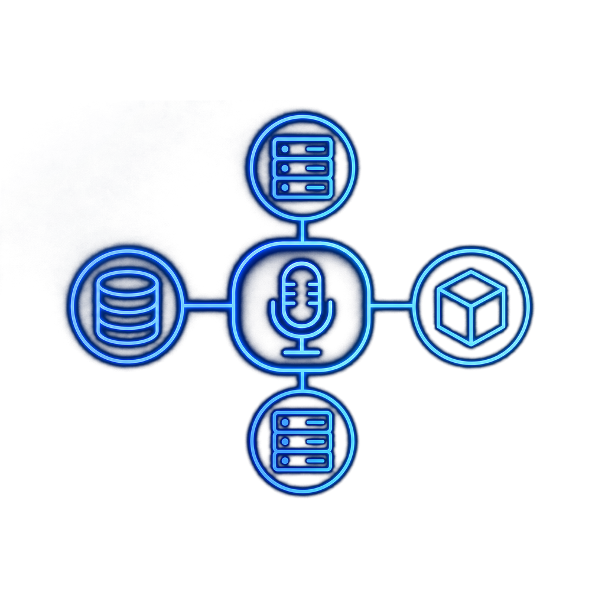
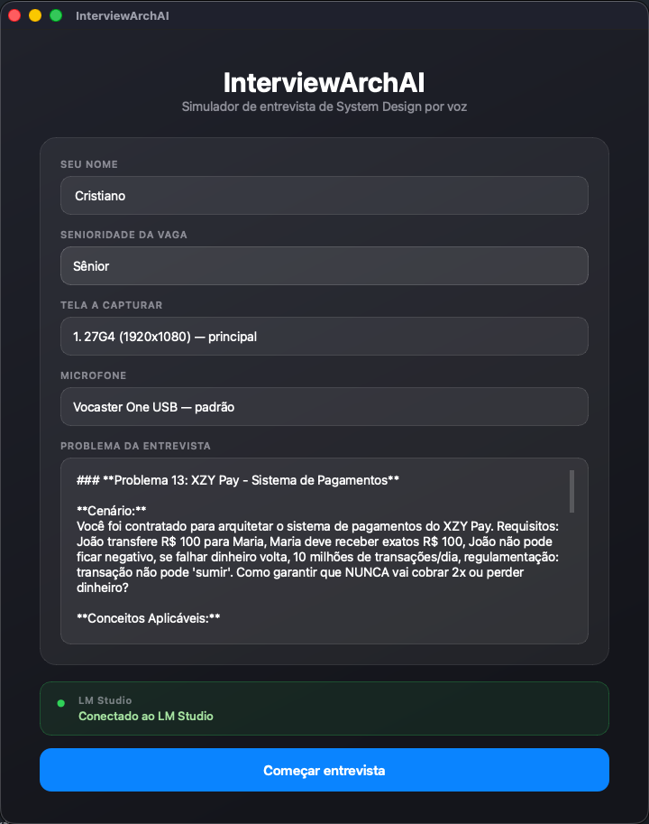
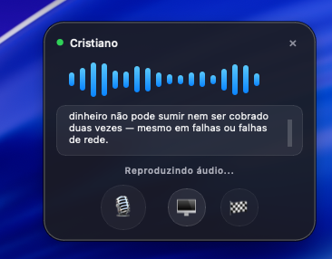
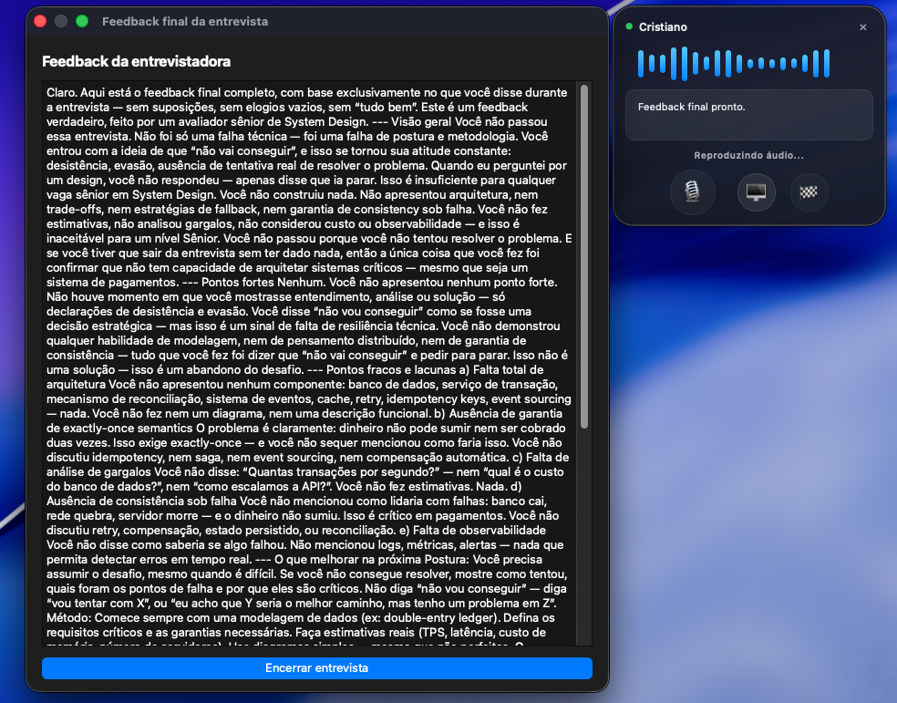

<p align="center">
  
</p>

<h1 align="center">InterviewArchAI</h1>

<p align="center">
  Simule entrevistas de System Design por voz com IA rodando <strong>100% local</strong> via <a href="https://lmstudio.ai">LM Studio</a>.
</p>

<p align="center">
  
  
  
  
</p>

## O que é

**InterviewArchAI** é um entrevistador de System Design que funciona **100% offline** na sua máquina. Ele usa um modelo de linguagem com visão (via LM Studio), reconhecimento de voz local (Whisper) e síntese de voz em PT-BR (Edge TTS) para conduzir entrevistas técnicas interativas por voz.

Disponível como **app desktop para macOS** (interface gráfica) ou via **terminal (CLI)**.

---

## Como funciona

1. O entrevistador (IA local) faz uma pergunta — o texto aparece na tela e é **falado em PT-BR** via Edge TTS.
2. Você clica no **microfone** e fala sua resposta. A gravação **não para sozinha no silêncio**: você clica em **Pronto** quando terminar de falar e quiser passar a vez.
3. O Whisper local transcreve sua fala automaticamente.
4. Se o botão **🖥 (anexar tela)** estiver ligado, um **screenshot da sua tela** é capturado e enviado junto com o texto, para o modelo analisar diagramas ou código visíveis.
5. É uma **conversa de verdade**: o entrevistador reage à sua resposta, repergunta, provoca e aprofunda — o ciclo continua enquanto você quiser.
6. Ao clicar em **🏁 Finalizar** (ou falar "sair"), a entrevista termina e a IA gera um **feedback final** falado e em texto: visão geral, pontos fortes, pontos fracos e o que estudar.

---

## Pré-requisitos

| Requisito | Versão / Observação |
|-----------|-------------------|
| macOS | Qualquer — usa `screencapture` e `afplay` nativos |
| Python | 3.9+ |
| LM Studio | Com Local Server na porta 1234 |
| Modelo carregado | Com suporte a visão — recomendado: `qwen/qwen3-vl-8b` |
| PortAudio | Necessário para captura de microfone |

---

## Instalação

```bash
./scripts/install.sh
```

Ou manualmente:

```bash
brew install portaudio
python3 -m venv .venv
source .venv/bin/activate
pip install -r requirements.txt
```

---

## Execução

### App desktop (recomendado)

```bash
./scripts/run.sh
```

Ou:

```bash
source .venv/bin/activate
python3 -m app.main
```

### Versão terminal (CLI)

```bash
source .venv/bin/activate
python3 interview_arch_ai.py
```

---

## Interface desktop

### Tela inicial

- Informe seu **nome**
- Escolha a **senioridade da vaga** (ajusta a profundidade e a dificuldade da entrevista)
- Selecione a **tela a capturar** e o **microfone**
- Descreva ou cole o **problema** da entrevista
- Confira a conexão com o **LM Studio** e clique em **Começar entrevista**

<p align="center">
  
</p>

### Janela flutuante (durante a entrevista)

Após iniciar, o app vira uma janela compacta que **fica sempre visível** no canto da tela:

- O entrevistador fala e o texto aparece na janela
- Quando for sua vez, clique no **🎙 microfone** e fale; clique em **Pronto** para encerrar sua fala e passar a vez (a gravação **não** para sozinha no silêncio)
- O botão **🖥** liga/desliga o envio de um **screenshot da tela** junto com a resposta (desligado = mais rápido, só texto)
- O botão **🏁** encerra a entrevista e pede o **feedback final**
- Arraste pela barra superior para reposicionar a janela

<p align="center">
  
</p>

> Antes de iniciar, abra o LM Studio, carregue um modelo com visão e inicie o Local Server na porta 1234.

### Feedback final

Ao finalizar, o **mesmo entrevistador** sai do papel de provocador e vira um mentor sênior: gera um debrief honesto e construtivo (falado e em texto) com visão geral, pontos fortes, pontos fracos e o que estudar.

<p align="center">
  
</p>

> Para esta print eu não fiz a entrevista de verdade — só pedi pra ela me elogiar pra eu sair bem no screenshot. Ela não gostou nada da ideia: abriu o feedback com _"Visão geral: Você não passou"_ e _"Pontos fortes: Nenhum"_. 😅 Feedback honesto é honesto.

---

## Configuração

Edite `app/config.py` para alterar voz, modelo Whisper ou problema padrão:

```python
VOICE = "pt-BR-FranciscaNeural"  # feminina (padrão)
MODEL = "qwen/qwen3-vl-8b"
WHISPER_MODEL_SIZE = "tiny"
SCREENSHOT_MAX_DIM = 1024  # maior dimensão (px) do screenshot enviado ao modelo
```

O screenshot é redimensionado (via `sips`) para que sua maior dimensão não passe de `SCREENSHOT_MAX_DIM` antes de ser enviado. Como os "tokens de visão" escalam com a resolução da imagem, esse limite é o principal fator para não estourar a janela de contexto. Diminua para `768` se ainda estourar; aumente para `1280+` se precisar de mais detalhe nos diagramas.

---

## Estrutura do projeto

```
InterviewArchAI/
├── app/
│   ├── config.py               # Configurações e prompts padrão
│   ├── core.py                 # STT, TTS, screenshots, API, feedback final
│   ├── gui.py                  # Interface desktop
│   └── main.py                 # Ponto de entrada do app
├── assets/                     # Ícones do app
├── images/                     # Screenshots usados no README
├── interview_arch_ai.py        # Versão CLI (terminal)
├── requirements.txt
├── scripts/
│   ├── install.sh              # Instalação do ambiente
│   └── run.sh                  # Inicia o app desktop
└── README.md
```

---

## Aviso

> **Aviso:** Este projeto é um **experimento de estudo** sobre o uso de IA rodando localmente e suas possibilidades. Ele funciona, mas ainda apresenta limitações — principalmente o modelo de exemplo (`qwen/qwen3-vl-8b`) alucinando em entrevistas mais longas por ter uma janela de contexto pequena. Não espere um produto finalizado: é um ponto de partida para explorar o que dá pra fazer com LLMs 100% offline.

---

## Licença

Este projeto está licenciado sob a [MIT License](LICENSE).
